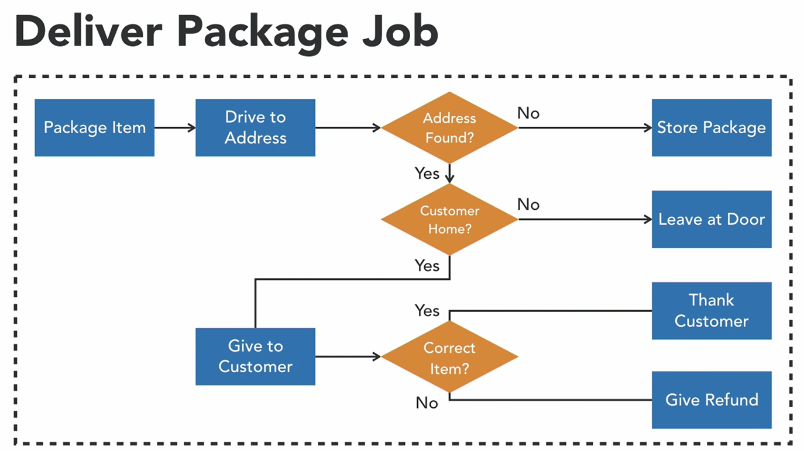

# Getting Started




### Reference Documentation
For further reference, please consider the following sections:

* [Official Apache Maven documentation](https://maven.apache.org/guides/index.html)
* [Spring Boot Maven Plugin Reference Guide](https://docs.spring.io/spring-boot/3.4.3/maven-plugin)
* [Create an OCI image](https://docs.spring.io/spring-boot/3.4.3/maven-plugin/build-image.html)
* [Spring Batch](https://docs.spring.io/spring-boot/3.4.3/how-to/batch.html)

### Guides
The following guides illustrate how to use some features concretely:

* [Creating a Batch Service](https://spring.io/guides/gs/batch-processing/)
* [Accessing data with MySQL](https://spring.io/guides/gs/accessing-data-mysql/)

### Main components
+ Job
+ Flow
+ Steps

### Steps
+ Tasklet
+ Chunk

## Tasklet
### Flow
+ sequential 
```java
start(step1)
   .next(step2)
   .next(step3)
   .end()
```
+ conditional 
```java 
    start(step1).on("FAILED").to(step2)
    .from(step1).on(*).to(step3)
    . end()
```

### Termination 
+ .end
+ .stop (rerunnable)
+ .fail (rerunnable)

### Listener
+ JobExecutionListener
+ StepExecutionListener
+ ChunkListener
+ SkipListener
+ RetryListener

### nested Jobs and Steps
```java
	@Bean
	public Step nestedBillingJobStep() {
		return this.stepBuilderFactory.get("nestedBillingJobStep").job(billingJob()).build();
	}

@Bean
public Job deliverPackageJob() {
    return this.jobBuilderFactory.get("deliverPackageJob")
            .start(packageItemStep())
            .on("*").to(deliveryFlow())
            .next(nestedBillingJobStep())
            .end()
            .build();
}
```
### Splits - execute in parallel
```java 
	public Job deliverPackageJob() {
		return this.jobBuilderFactory.get("deliverPackageJob")
				.start(packageItemStep())
				.split(new SimpleAsyncTaskExecutor())
				.add(deliveryFlow(), loyaltyFlow())
				.end()
				.build();
	}
```


## Chunks
+ Step
    + ItemReader - one item at a time, chunk by chunk (OOTB: Kafka; FlatFile; HibernateCursor (one thread);  HibernatePaging(multi thread);  JdbcCursor; JdbcPaging; JpaPaging; Mongo; StaxEvent; Json
    + ItemProcessor - (optional) one item by one in chunk, chunk by chunk (transform, filter, validate(JSR 380), chain)
    + ItemWriter - chunk by chunk (each chunk is transactional)


### JdbcBatchItemWriter
it is better to use it with named parameters same as the fields in pojo
```java 
.sql("insert into TABLE(coulumnname1, coulumnname2)  values(:parameterName1,:parameterName2)")
.beanMapped()
```

### Bean Validation. 
add maven dependencies
```java
Class Order{
    @Pattern(regexp = ".*\\.gov")
    private String email;
}

@Bean
public ItemProcessor<Order, Order> orderValidatingItemProcessor() {
  BeanValidatingItemProcessor<Order> processor = new BeanValidatingItemProcessor<>();
  processor.setFilter(true);
  return processor;
}
```

### chain of processors
execute validation and transformation one by one
```java
    @Bean
    public ItemProcessor<Order, TrackedOrder> compositeItemProcessor() {
        return new CompositeItemProcessorBuilder<Order,TrackedOrder>()
                .delegates(orderValidatingItemProcessor, new TrackedOrderItemProcessor())
                .build();
    }
```
### Filter itemProcessor
if bean returns null this item will be skipped
```java
@Component
public class FreeShippingItemProcessor implements ItemProcessor<TrackedOrder, TrackedOrder> {
  @Override
  public TrackedOrder process(TrackedOrder order) throws Exception {
    order.setFreeShipping(order.getCost().compareTo(new BigDecimal("80")) == 1);
    return order.isFreeShipping()?order:null;
  }
}
```

### skips and error handling
```java 
                .processor(compositeItemProcessor())
                .faultTolerant()
                .skip(OrderProcessingException.class)
                .skipLimit(10)
                .listener(new CustomSkipListener())
```